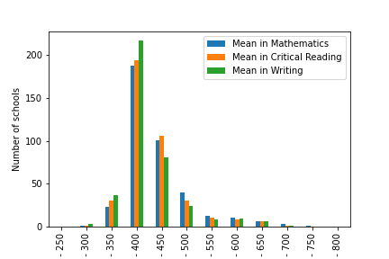
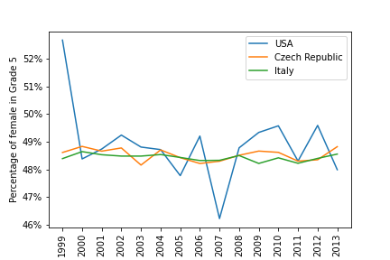

# Simple-Data-Visualization

A simple project on Data Visualization for CSCI-40 course - the instructions can be found [here](https://github.com/mikeizbicki/cmc-csci040/tree/2021fall/hw_02)

## Website

I have created a simple website for this project. 

## SAT results in New York in 2010

[Data Source](https://catalog.data.gov/dataset/sat-college-board-2010-school-level-results)

In this plot, you can see the distribution of SAT score means for schools in New York in 2010. The test score means are broken down into the three score categories that were used that year. As this is a distribution of means, we see the expected skewed normal distribution. The number of test-takers in each school was omitted.

## Female enrolment in Grade 5 of primary education in selected countries

This plot shows the development of the percentage of females in Grade 5 of primary education for three selected countries during the 1999-2013 period. Given that all three selected countries are generally considered developed countries, it is not surprising to see slightly below 50% of the student body consisting of females. The USA data is surprisingly volatile. Other potentially more interesting countries were not included due to the incompleteness of data.

[Data Source](http://data.un.org/Data.aspx?q=education&d=UNESCO&f=series:E_1_G5&c=2,3,5,7,9,10&s=ref_area_name:asc,time_period:desc&v=1)

